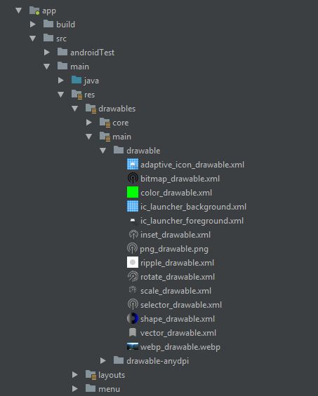

# Android drawable preview plugin

Android studio and IntelliJ IDEA plugin that replaces default icons with drawables previews inside project view.

A very fine article is also present explaining detailings regarding Drwable preview plugins.Hope it may help someone.
[https://medium.com/mindorks/view-your-drawables-images-thumbnails-in-android-studio-1baacb0ce784]

# Installation

1. Download [plugin zip archive](./release/drawable_preview-1.1.4.zip)
2. Inside Android Studio go to File -> Settings -> Plugins -> Install plugin from disk
3. Select zip archive

## OR

1. Inside Android Studio go to File -> Settings -> Plugins -> Browse repositories
2. Search Android Drawable Preview
3. Click Install Plugin
